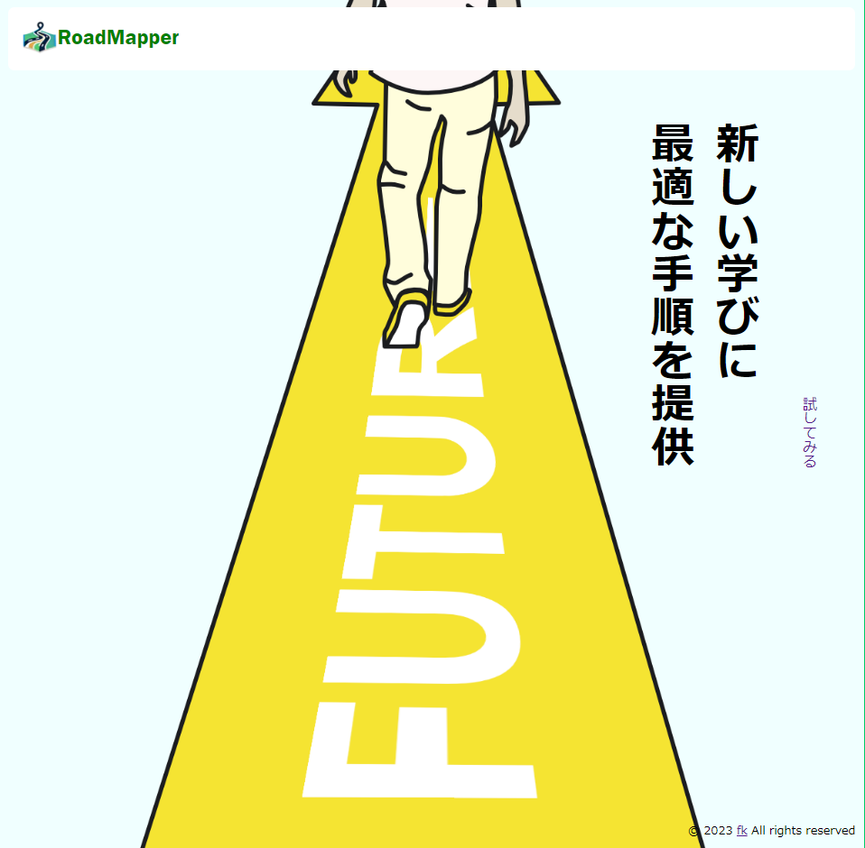
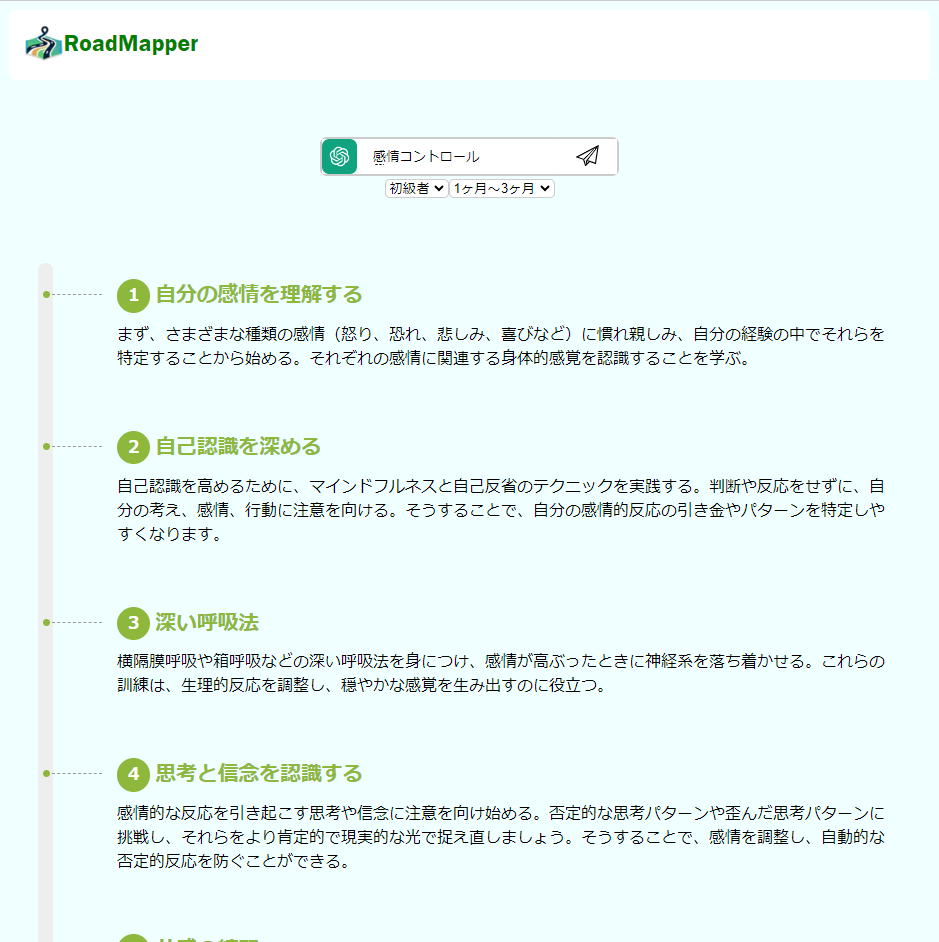
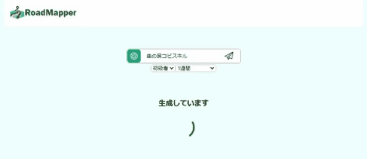

🚨ChatGPTAPIのCreditが0$で不足しており現在機能しておりません

  
  
新しい学びに最適な手順を

# RoadMapper

  
  

## フロントエンド仕様
### 機能
- レスポンシブ対応
- 入力欄全てを埋めたときのみ送信(HTTPリクエスト)
- フロー生成時間の待機アニメーション

  

- フロー生成待機中は送信不可

## 使用技術
- TypeScript
- Next.js(React)
- Sass

(関連)
- dotenv
- vercel

## 課題
- APIを叩く待機時間が長い  

※初期生成時はバックエンドの初期起動も入るため1分半程待つ必要があります。二回目以降は約30秒程で生成されます。  
→バックエンドの初期起動はバックエンドのデプロイ先のRenderの仕様なのでアップグレードして解決するしかない
